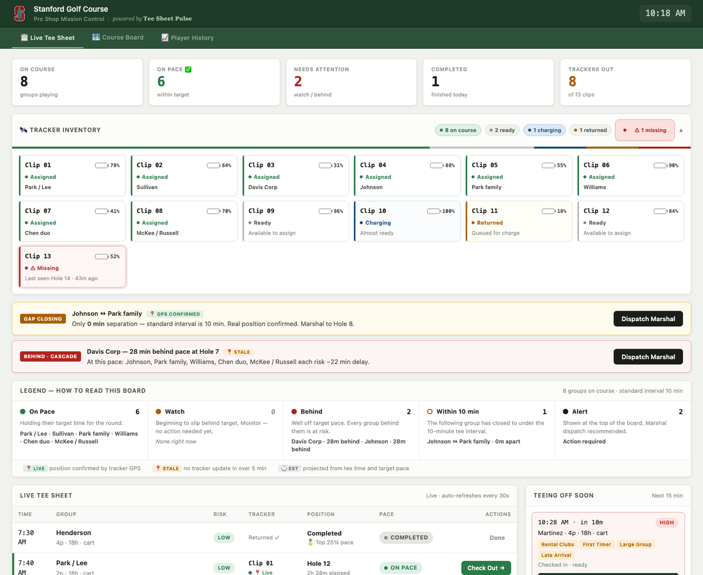
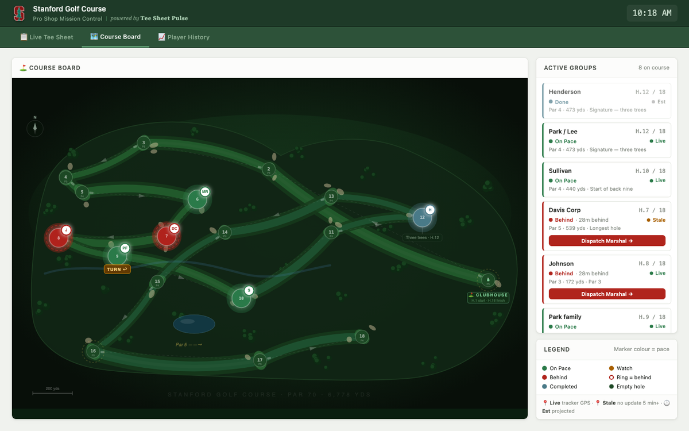
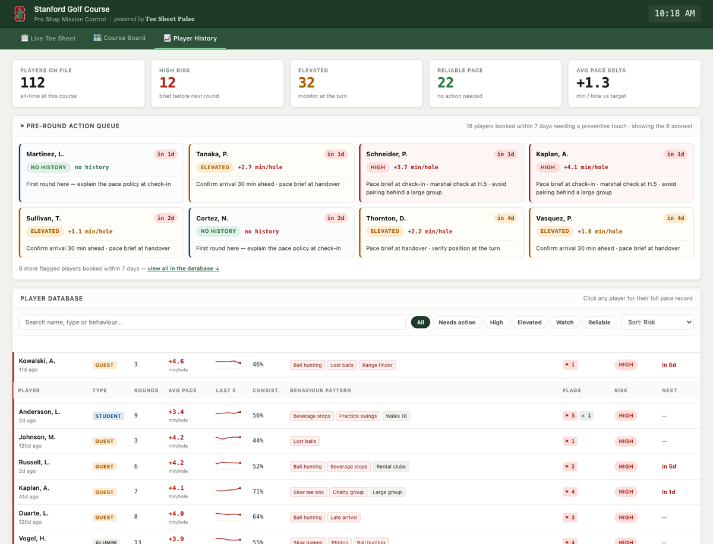

# Tee Sheet Pulse

Real-time pace-of-play management for semi-private and university golf courses.

**[▶ Open the live dashboard](https://lotusflowerrain.github.io/tee-sheet-pulse/)**
· [Run the self-test](https://lotusflowerrain.github.io/tee-sheet-pulse/?selftest=1)
(40 assertions against the pace logic)
· [Architecture & data flow](ARCHITECTURE.md)

> GitHub shows `index.html` as source. Use the link above to actually run it —
> or clone and open `index.html` in a browser. No build step, no dependencies.

Built for CEE 250 / MS&E 265 (Feature Flow), Stanford, Spring 2026.

---

## What this is

A pro shop board that treats pace-of-play as a **queueing problem**: the cost of
a slow group is not local, it is every group behind them. So the thing worth
alerting on is not "this group is slow," it is "this group is about to make five
other groups slow."

Three views, all driven by the same pace model.

### Live Tee Sheet

Pace status per group, gap and cascade alerts, tracker assignment, and a legend
covering On Pace / Watch / Behind / Within 10 min / Alert.

### Course Board

Illustrated course map with live group positions, colour-coded by pace.

### Player History

A database of recorded pace behaviour per player, used to brief the marshal for
preventive action *before* a player's next round.

---

## Scope — what is real and what is simulated

| Layer | Status |
|---|---|
| Pace model, risk scoring, cascade projection, alert logic | **Real** — 40 assertions, `?selftest=1` |
| Pro shop UI, all three views, check-in / check-out / dispatch | **Real** |
| Player database (112 players) | **Real schema, synthetic rows** |
| Group positions | **Simulated** — projected from tee time × target pace |
| GPS clip hardware | **Not manufactured.** Designed in Fusion 360 |
| Backend, persistence, auth | **None** — single static file, no network I/O |

The alerting logic was designed first, against a deterministic simulator, so the
position source could be swapped in later without the logic changing. The
`position()` function is the only place that knows where a position came from —
see [ARCHITECTURE.md §5–6](ARCHITECTURE.md).

The golfer-facing page was dropped; the product is the pro shop board.

Pro shop dashboard built with AI-assisted development (Claude Code); see
[ARCHITECTURE.md §11](ARCHITECTURE.md) for the division of labour.
